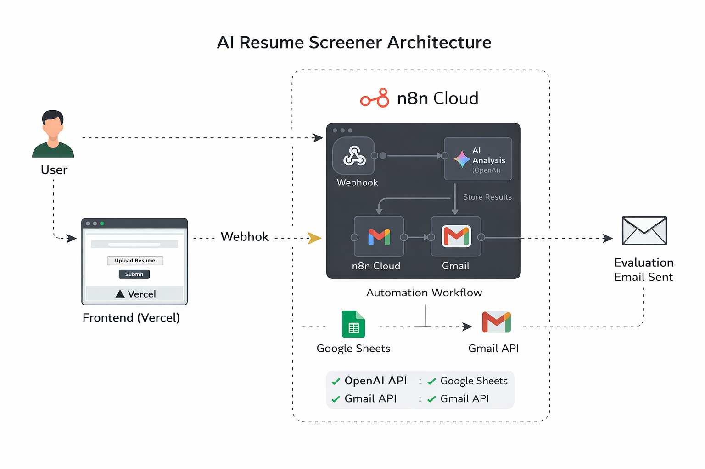

# AI Resume Screener (End-to-End Automation)

Live App:
https://ai-resume-screener-frontend-mu.vercel.app/

## Overview
This project automatically screens resumes using AI and sends an evaluation email to candidates.

Users upload a resume → AI evaluates → data stored → email sent automatically.

## Tech Stack
Frontend: HTML, JavaScript (Vercel)
Automation Backend: n8n Cloud
AI: OpenAI API
Database: Google Sheets
Email Service: Gmail API

## Workflow Architecture
1. Candidate uploads resume via web form
2. Webhook triggers n8n workflow
3. Resume text extracted
4. OpenAI analyzes and scores candidate
5. Results stored in Google Sheets
6. Email with evaluation sent automatically

## Features
- Fully automated resume screening
- AI scoring and feedback
- Real-time email notification
- Cloud-hosted end-to-end pipeline
- Error monitoring workflow

## Why this project matters
This demonstrates real-world automation, API integration, and cloud deployment.

## Architecture Diagram

